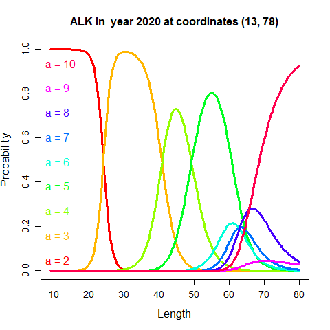

<!-- badges: start -->
[](https://github.com/NorskRegnesentral/spatioTemporalIndices/actions/workflows/R-CMD-check.yaml)
[](https://codecov.io/gh/NorskRegnesentral/spatioTemporalIndices)
<!-- badges: end -->

## spatioTemporalIndices
Git page for the R-package `spatioTemporalIndices`. 

This model uses catch-at-length and age-at-length observations to construct indices-at-length and indices-at-age. It does so by combining two separate spatio-temporal models: one for catch-at-length and one for age-at-length. The catch-at-lengh model is published in [Breivik et al. (2021)](https://doi.org/10.1093/icesjms/fsab073) and the extension with age-at-lengh is published in [Breivik et al. (2024)](https://doi.org/10.1093/icesjms/fsae079).


### Installation

The R-package can be installed by typing: 

```R
remotes::install_github("NorskRegnesentral/spatioTemporalIndices/spatioTemporalIndices")
```

# A quick example

Here is a quick example of how to generate indices-at-age with associated covariance structures. For the full R code to run a similar example, see the section "A quick runable example" blow. We use North East Arctic haddoc observations from Norwegian vessels as our example data.


### Data

The length data must be in the format of a data frame with the following columns: haul ID, length group, time, distance trawled, latitude, longitude, and the number of fish caught. Note that each row represents one observed length group in a haul.

```R
station   lengthGroup   startdatetime   distance  latitude longitude   catch
idHaul1   5         2018-02-02 11:10:46    0.89     73.34    18.13     0
idHaul1   10        2018-02-02 11:10:46    0.89     73.34    18.13     20
idHaul1   15        2018-02-02 11:10:46    0.89     73.34    18.13     52
idHaul1   20        2018-02-02 11:10:46    0.89     73.34    18.13     22
```

The age-at-length data must be in the format of a data frame with the following columns: haul ID, time, latitude, longitude and length of fish, and readability (optional). Note that each row represents one observed fish. The station ID needs to match the ID given in the length data above.


```R
station   startdatetime       latitude longitude length age readability
idHaul1   2018-02-02 11:10:46  73.34    18.13     32      3         1
idHaul1   2018-02-02 11:10:46  73.34    18.13     28      3         1
idHaul1   2018-02-02 11:10:46  73.34    18.13     17      1         1
idHaul1   2018-02-02 11:10:46  73.34    18.13     54      5         1
```

### Confgurations

Set up configurations for catch-at-length model:

```R
conf_l = defConf(years = 2018:2020, # years to use, 
                 maxLength = 75, 
                 minLength = 20, 
                 spatioTemporal =0 ,
                 spatial =1,
                 stratasystem = list(dsn="strata", layer = "Vintertoktet_nye_strata"),
                 applyALK = 1)
```

Set up configurations for age-at-length model.

```R
conf_alk = defConf_alk(maxAge = 10,
                       minAge = 3,
                       spatioTemporal = 2,
                       spatial =1)
```

For documentation of the configurations, see `?defConf` and `?defConf_alk`.


Set up prediction configurations:

```R
confPred = defConfPred(conf=conf_l,cellsize = 20)
```

### Fit model

Fit the model 
```R
run = fitModel(dat_l,conf_l, confPred,dat_alk,conf_alk)
```


### Extract indices and covariance structures
The indices and their associated standard deviations can be accessed in the list of reported quantities:
```R
run$rl$logAgeIndex
run$rlSd$logAgeIndex
```
 The indices can be save on standard ICES format with the function `write_indices_ICES_format`. Yearly covariance matrices can be save with the function `write_covariance_matrices`


<br>

# A quick runable example

As a runnable example, we will use data on North East Arctic haddock collected by Norwegian vessels.

First, we need to load the package:

```R
library(spatioTemporalIndices)
```

Then we download the example data:

```R
setwd(tempdir())
files = c("haddock2018-2020_age_ex_rus_reduced.rds", "haddock2018-2020_length_ex_rus_reduced.rds")
url <- "https://raw.githubusercontent.com/NorskRegnesentral/spatioTemporalIndices/main/spatioTemporalIndices/tests/testthat/NEAhadLengthAge/"
d <- lapply(files, function(f)download.file(paste(url,f,sep=""), f))
dat_length <- readRDS("haddock2018-2020_length_ex_rus_reduced.rds")
dat_age <- readRDS("haddock2018-2020_age_ex_rus_reduced.rds")
```

We also download the survey domain:


```R
base_url <- "https://raw.githubusercontent.com/NorskRegnesentral/spatioTemporalIndices/main/spatioTemporalIndices/tests/testthat/NEAhadLengthAge/strata/"
shapefile_files <- c("Vintertoktet_nye_strata.shp", 
                     "Vintertoktet_nye_strata.shx", 
                     "Vintertoktet_nye_strata.dbf", 
                     "Vintertoktet_nye_strata.prj")
lapply(shapefile_files, function(f) download.file(paste0(base_url, f), f, mode = "wb"))
```

Set up configurations for the `catch-at-length` model:

```R
conf_l = defConf(years = 2018:2020, # years to use,
                 maxLength = 75, #Maximum length (plus group)
                 minLength = 20, #Minimum length used in index calculation
                 spatioTemporal =2 , #2: Independent spatial fields across years
                 dLength = 5, #5 cm length bins
                 spatial =1, #1: A common spatial field across time
                 stratasystem = list(dsn="Vintertoktet_nye_strata.shp", layer = "Vintertoktet_nye_strata"),
                 applyALK = 1 #1: We combine with the ALK-model to construct indices-at-age
                 )
```

Similarly for the `age-at-length` model:

```R
conf_alk = defConf_alk(maxAge = 10, #Maximum age (plus group) for index calculation
                       minAge = 3, #Minimum age
                       spatioTemporal = 2, #2: Independent spatial fields across years
                       spatial =1 #1: A common spatial field across time
                       )
```

Set up prediction configurations:

```R
confPred = defConfPred(conf=conf_l,
                       cellsize = 20 #20 km distance between spatial integration points for index calculation
                       )
```

Now, everything is set to fit the model:

```R
run = fitModel(dat_length,conf_l, 
               confPred,
               dat_age,
               conf_alk,
               ignore.parm.uncertainty = TRUE)
```

We can then extract the indices and plot structures.

Here, we plot the spatially estimated CPUE at a length of 40 cm and age 5 for the year 2020:
 
```R
plotResults(run,what = c("space",2020,40,"length"))
plotResults(run,what = c("space",2020,5,"age"))

#Add map to plot
world <- rnaturalearth::ne_countries(scale = "medium", returnclass = "sf")
utm_crs <- paste0("+proj=utm +zone=", run$conf_l$zone," +datum=WGS84 +units=km +no_defs")
world_utm <- sf::st_transform(world, crs = utm_crs)
plot(sf::st_geometry(world_utm),add = TRUE)
```
<div style="display: flex;">
  
  
</div>

We can also plot the ALK at different spatial locations. For example, here we plot the ALK for the year 2020, west of Svalbard and north of Varanger (the northern part of the Norwegian mainland). We observe clear spatial differences.

```R
plotResults(run,what = "ALK",year =2020,lon_lat = c(13,78))
plotResults(run,what = "ALK",year =2020,lon_lat = c(30,71.5))

```

<div style="display: flex;">
  
  
</div>


We can also plot the depth effect and sun-altitude effect on catch-at-length:

```R
plotResults(run,what = "depth")
plotResults(run,what = "sunAlt")

```

<div style="display: flex;">
  
  
</div>

We can plot the time-varying variance of the indices, and the time varying within-year correlation structure. These time-varying structures can be used in the assessment.

```R
plotResults(run,what = "variance") #Used conf_l$years = 1994:2020 to produce figure
plotResults(run,what = "correlation")

```

<div style="display: flex;">
  
  
</div>

#### Saving the indices

Indices can be saved in the standard ICES format by:

```R
write_indices_ICES_format(run,file = "indexFile.dat", name = "nameOfSurvey",digits = 0)

```
The file follows the standard ICES format and looks like this:
```plaintext
nameOfSurvey
2018 2020
1 1 0.11 0.15
3 10
1 3600743 1298251 880572 134994 268370 54879 55082 199206
1 7780117 3056598 616185 312397 57086 49632 12486 56953
1 4660653 4125865 869566 186988 105888 25585 11477 46153

```


The variance of the log-indices in the same format can be saved by:

```R
write_indices_ICES_format(run,file = "indexFileVar.dat",variance = TRUE, name = "nameOfSurvey",digits = 2)

```


A list of the estimated yearly covariance matrices can be saved by:

```R
write_covariance_matrices(run,file = "covar.rds")

```

The list can then be read by `readRDS(covar.rds)`.


<br>

## Use of index and covariance structures in assessment

For the use of the indices and covariance structures in the state space assessment model SAM, we refer to the SAM help file at  http://www.nielsensweb.org/configurations.html.

<br>

## References

Breivik, O. N., Aanes, F., Søvik, G., Aglen, A., Mehl, S., & Johnsen, E. (2021). Predicting abundance indices in areas without coverage with a latent spatio-temporal Gaussian model, ICES Journal of Marine Science, Volume 78, Issue 6, September 2021, Pages 2031–2042, https://doi.org/10.1093/icesjms/fsab073

Breivik, O. N., Zimmermann, F., Johannesen, E., Ono, K., Fall, J.,  Howell D., Nielsen, A., Incorporation of observation uncertainty in stock assessment using spatio-temporal modeling of catch-at-length and age-at-length survey data, ICES Journal of Marine Science, Volume 81, Issue 7, September 2024, Pages 1195–1208, https://doi.org/10.1093/icesjms/fsae079
