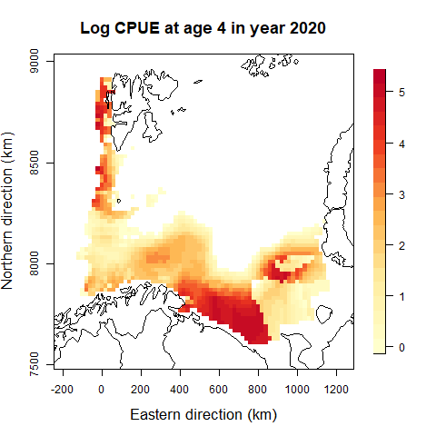

<!-- badges: start -->
[](https://github.com/NorskRegnesentral/spatioTemporalIndices/actions/workflows/R-CMD-check.yaml)
<!-- badges: end -->

## spatioTemporalIndices
Git page for the R-package `spatioTemporalIndices`. 

This model uses catch-at-length and age-at-length observations to construct indices-at-length and indices-at-age. It does so by combining two separate spatio-temporal models: one for catch-at-length and one for age-at-length. The catch-at-lengh model is published in [Breivik et al. (2020)](https://doi.org/10.1093/icesjms/fsab073) and the extension with age-at-lengh is published in [Breivik et al. (2024)](https://doi.org/10.1093/icesjms/fsae079).


### Installation

The R-package can be installed by typing: 

```R
remotes::install_github("NorskRegnesentral/spatioTemporalIndices/spatioTemporalIndices")
```

# A quick example

Here is a quick example of how to generate indices-at-age with associated covariance structures. For the full R code to run a similar example, see the section "A quick runable example" blow. We use North East Arctic haddoc observations from Norwegian vessels as our example data.


### Data

The length data must be in the format of a data frame with the following columns: haul ID, length group, time, distance trawled, latitude, longitude, and the number of fish caught. Note that each row represents one observed length group in a haul.

```R
station   lengthGroup   startdatetime   distance  latitude longitude   catch
idHaul1   5         2018-02-02 11:10:46    0.89     73.34    18.13     0
idHaul1   10        2018-02-02 11:10:46    0.89     73.34    18.13     20
idHaul1   15        2018-02-02 11:10:46    0.89     73.34    18.13     52
idHaul1   20        2018-02-02 11:10:46    0.89     73.34    18.13     22
```

The age-at-length data must be in the format of a data frame with the following columns: haul ID, time, latitude, longitude and length of fish, and readability (optional). Note that each row represents one observed fish. The station ID needs to match the ID given in the length data above.


```R
station   startdatetime       latitude longitude length age readability
idHaul1   2018-02-02 11:10:46  73.34    18.13     32      3         1
idHaul1   2018-02-02 11:10:46  73.34    18.13     28      3         1
idHaul1   2018-02-02 11:10:46  73.34    18.13     17      1         1
idHaul1   2018-02-02 11:10:46  73.34    18.13     54      5         1
```

### Confgurations

Set up configurations for catch-at-length model:

```R
conf_l = defConf(years = 2018:2020, # years to use, 
                 maxLength = 75, 
                 minLength = 20, 
                 spatioTemporal =0 ,
                 spatial =1,
                 stratasystem = list(dsn="strata", layer = "Vintertoktet_nye_strata"),
                 applyALK = 1)
```

Set up configurations for age-at-length model.

```R
conf_alk = defConf_alk(maxAge = 10,
                       minAge = 3,
                       spatioTemporal = 2,
                       spatial =1)
```

For documentation of the configurations, see `?defConf` and `?defConf_alk`.


Set up prediction configurations:

```R
confPred = defConfPred(conf=conf_l,cellsize = 20)
```

### Fit model

Fit the model 
```R
run = fitModel(dat_l,conf_l, confPred,dat_alk,conf_alk)
```


### Extract indices and covariance structures
The indices and their associated standard deviations can be accessed in the list of reported quantities:
```R
run$rl$logAgeIndex
run$rlSd$logAgeIndex
```

The indices and corresponding covariance structures can be saved by

```R
saveIndex(run,file = "index.txt", folder = "")
```

This will save the files `index.txt` and `cov_index.Rda`, containing the indices and a list with all yearly covariance matrices.

# A quick runable example

As a runable example we will use data on North East Arctic haddock collected by Norwegian vessels.

First we need to library the package:

```R
library(spatioTemporalIndices)
```

Download example data:

```R
setwd(tempdir())
files = c("haddock2018-2020_age_ex_rus_reduced.rds", "haddock2018-2020_length_ex_rus_reduced.rds")
url <- "https://raw.githubusercontent.com/NorskRegnesentral/spatioTemporalIndices/main/spatioTemporalIndices/tests/testthat/NEAhadLengthAge/"
d <- lapply(files, function(f)download.file(paste(url,f,sep=""), f))
dat_length <- readRDS("haddock2018-2020_length_ex_rus.rds")
dat_age <- readRDS("haddock2018-2020_age_ex_rus.rds")
```

Download example survey domain:


```R
base_url <- "https://raw.githubusercontent.com/NorskRegnesentral/spatioTemporalIndices/main/spatioTemporalIndices/tests/testthat/NEAhadLengthAge/strata/"
shapefile_files <- c("Vintertoktet_nye_strata.shp", 
                     "Vintertoktet_nye_strata.shx", 
                     "Vintertoktet_nye_strata.dbf", 
                     "Vintertoktet_nye_strata.prj")
lapply(shapefile_files, function(f) download.file(paste0(base_url, f), f, mode = "wb"))
```

Set up configurations for catch-at-length model:

```R
conf_l = defConf(years = 2018:2020, # years to use, 
                 maxLength = 75, #Maximum length (plus group)
                 minLength = 20, #Minum length used in index calculation
                 spatioTemporal =2 , #2: Indepentent spatial fields across years
                 dLength = 5, #5 cm length bins
                 spatial =1, #1: A commom spatial field across time
                 stratasystem = list(dsn="Vintertoktet_nye_strata.shp", layer = "Vintertoktet_nye_strata"),
                 applyALK = 1 #1: We combine with the ALK-model to construct indices-at-age
                 )
```

Set up configurations for age-at-lenght model:

```R
conf_alk = defConf_alk(maxAge = 10, #Maximum age (plus group) for index calculation
                       minAge = 3, #Minimuim age 
                       spatioTemporal = 0, #0: No spatio-temporal effect
                       spatial =0 #0: No spatio-temporal effect
                       )
```

Set up prediciton configurations:

```R
confPred = defConfPred(conf=conf_l,
                       cellsize = 20 #20 km distance between spatial integration points for index calculation
                       )
```

Fit the model

```R
run = fitModel(dat_length,conf_l, 
               confPred,
               dat_age,
               conf_alk,
               ignore.parm.uncertainty = TRUE)
```

Look at results:

```R
run$rl$logAgeIndex
#saveIndex(run,file = "index.txt", folder = "...") #Save indices and corresponding yarly covariance structures
```

Plot structures, e.g., spatial CPUE at both lenght and age:

```R
plotResults(run,what = c("space",2020,50,"length"))
plotResults(run,what = c("space",2020,5,"age"))
```





### Use of index and covariance structures in assessment

For the use of the indices and covariance structures in the state space assessment model SAM, we refer to the SAM help file at  http://www.nielsensweb.org/configurations.html.


### Refernces

Breivik, O. N., Aanes, F., Søvik, G., Aglen, A., Mehl, S., & Johnsen, E. (2021). Predicting abundance indices in areas without coverage with a latent spatio-temporal Gaussian model. ICES Journal of Marine Science, 78(6), 2031-2042. https://doi.org/10.1093/icesjms/fsab073

Breivik (2024) ICES Journal of Marine Science, Volume 81, Issue 7, September 2024, Pages 1195–1208,
https://doi.org/10.1093/icesjms/fsae079
